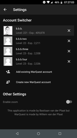

# WarQuest Android App
*An Android client for the online game WarQuest!*

WarQuest for Android is a free multi player online game (MPOG) featuring a war zone with thousands of players. WarQuest takes you to the year 2020. The world is at war. The goal of the game is to defend your country and conquer others. Buy weapon and production units, play missions, fight, make allies and become the best player of your country. Enter the war zone if you dare!

## Install the app
The easiest way to download the app is via the [Google Play Store](https://play.google.com/store/apps/details?id=nl.plaatsoft.warquest3).

If you don't want to use the Google Play store, you can always download the latest `apk` file from the [release tab](https://github.com/bplaat/warquest-android/releases).

## Screenshots
Here are some screenshots I took from my phone:

## License
Copyright &copy; 2018 - present Bastiaan van der Plaat

Licensed under the [MIT](LICENSE) license.
